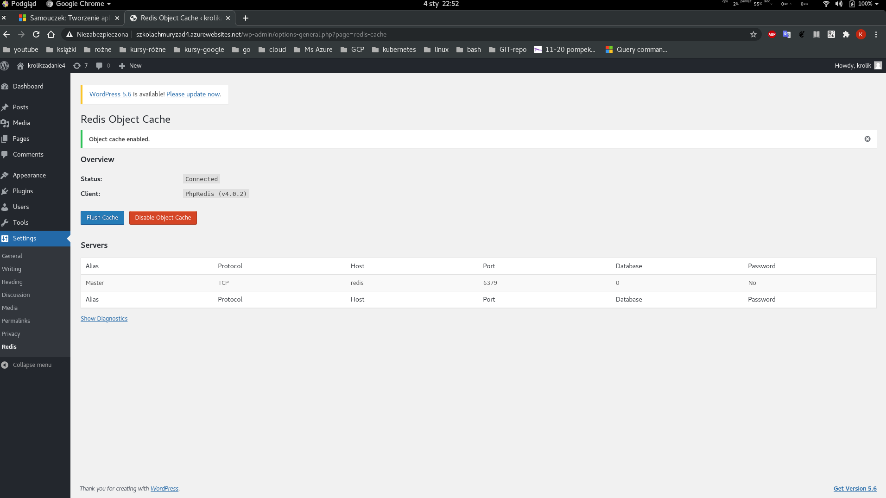
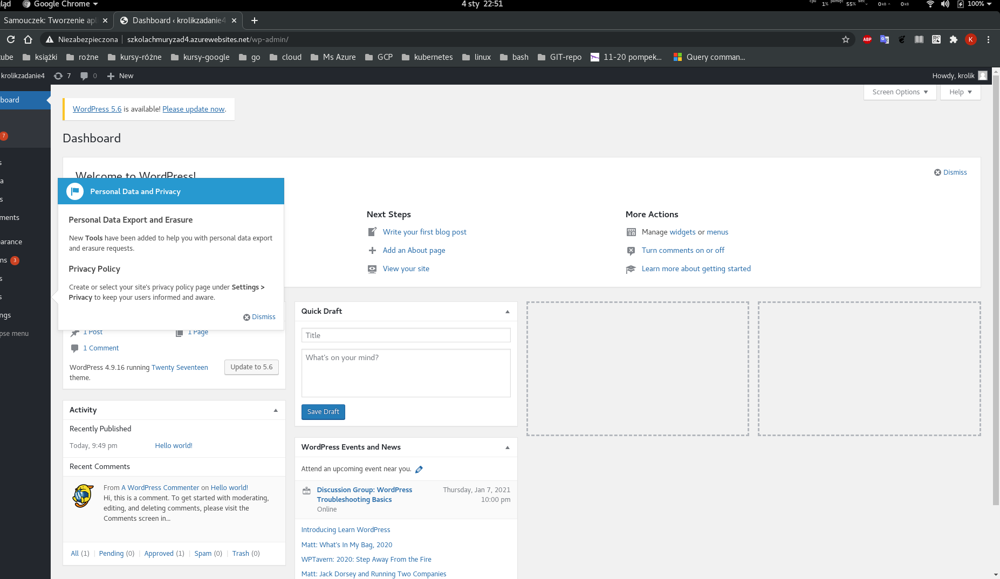

# Zadanie nr 4. 
> Zbuduj usługą wykorzystującą jakąkolwiek bazę lub storage na Azure.
Z tym pisaniem softu u mnie raczej ciężko, więc zrobię prostego Wordpresa w kontenerze i podłączę go do mysql'a

## Tworzenie zasobów
```bash
git clone https://github.com/Azure-Samples/multicontainerwordpress

cd multicontainerwordpress

#Wszystkie obsługiwane lokalizacje dla usługi App Service w systemie Linux w warstwie Standardowa
az appservice list-locations \
--sku S1 \
--linux-workers-enabled \
--output table

#zmienne
export myResourceGroup=zadanie4tk
export location=germanywestcentral

export planName=myAppServicePlan
export appName=szkolachmuryzad4

# Grupa zasobów
az group create \
--name $myResourceGroup \
--location $location

# Test --query
az group show --resource-group  $myResourceGroup --query 'id' -o json

"/subscriptions/4c18ac9c-3885-4370-baf7-bf15e9c3f783/resourceGroups/zadanie4tk"

group show --resource-group  $myResourceGroup --query 'name' -o json

"zadanie4tk"
## Fajne narzęzie np do tworzenia zmienych

#App Service
az appservice plan create \
--name  $planName \
--resource-group  $myResourceGroup \
--sku S1 \ #Stndard
--is-linux #LinuxContainer
```

## Docker Compose z kontenerami WordPress i MySQL
```bash
# Tworzenie aplikacji narzędzia Docker Compose
# Wielokontenerowa aplikacja internetowa w ramach planu usługi App Service. 
# docker-compose-wordpress.yml znajduje się w katalogi z demo zaciągniętym z gita. 
# Tylko czemy yml anie yaml, to pewnie już tylko Bill wie.
az webapp create \
--resource-group $myResourceGroup \
--plan $planName \
--name $appName \
--multicontainer-config-type compose \
--multicontainer-config-file docker-compose-wordpress.yml

# Ważna część wyniku polecenia
...
    ],
    "hostNames": [
        "szkolachmuryzad4.azurewebsites.net"
    ],
...
# Ale jak się zgubi to --query pomoże
az webapp show -g $myResourceGroup -n $appName --query hostNames
[
  "szkolachmuryzad4.azurewebsites.net"
]
```
## Nawiązywanie połączenia z produkcyjną bazą danych
```bash
# zmienne
export mySQLname=zadanie4-mysql-base
export dbName=wordpress
export AzureIPs=allAzureIPs

# Serwer usługi Azure Database for MySQL
# Ta nazwa jest częścią nazwy hosta serwera MySQL (<mysql-server-name>.database.windows.net) i musi być unikatowa w skali globalnej.
# https://docs.microsoft.com/pl-pl/cli/azure/mysql/server?view=azure-cli-latest#az_mysql_server_create
az mysql server create \
--resource-group $myResourceGroup \
--name $mySQLname  \
--location $location \
--admin-user adminuser \
--admin-password My5up3rStr0ngPaSw0rd! \
--sku-name B_Gen5_1 \
--version 5.7

#Hakerskie sztuczki ze zmiennymi
echo "export sqlAdminUser=$(az mysql server show -n $mySQLname -g $myResourceGroup --query administratorLogin -o tsv)" >> ../.var

# Firewall
# Tworzę regułę zapory dla serwera MySQL, aby zezwolić na połączenia klienckie. Po ustawieniu początkowego i końcowego adresu IP na 0.0.0.0 zapora będzie otwierana tylko dla innych zasobów platformy Azure.
az mysql server firewall-rule create \
--name $AzureIPs \
--server $mySQLname \
--resource-group $myResourceGroup \
--start-ip-address 0.0.0.0 \
--end-ip-address 0.0.0.0

#TEst
az mysql server firewall-rule show -g $myResourceGroup -n $AzureIPs --server $mySQLname --query '[endIpAddress, startIpAddress]' -o table 

Result
--------
0.0.0.0
0.0.0.0

# Tworzenie bazy danych WordPress
az mysql db create \
--resource-group $myResourceGroup \
--server-name $mySQLname \
--name $dbName

#Zmienna
echo "export wordpress_db_host=$(az mysql server show -n $mySQLname -g $myResourceGroup --query fullyQualifiedDomainName -o tsv)" >> ../.var

# Konfigurowanie zmiennych bazy danych w rozwiązaniu WordPress
az webapp config appsettings set \
--resource-group $myResourceGroup \
--name $appName \
--settings WORDPRESS_DB_HOST="$wordpress_db_host" WORDPRESS_DB_USER="adminuser@$mySQLname" WORDPRESS_DB_PASSWORD="My5up3rStr0ngPaSw0rd!" WORDPRESS_DB_NAME="$dbName" MYSQL_SSL_CA="BaltimoreCyberTrustroot.crt.pem"

#Sprawdzam czy wszystko się zgadza:
az webapp config show -g $myResourceGroup -n $appName
#Zbyt ogólnoie

#Precyzyjniej
az webapp config appsettings list  \
-g $myResourceGroup \ # -g = --resource-group
-n $appName \ # -m = --mame
--query '[].{Name:name, Value:value}' -o table

Name                   Value
---------------------  --------------------------------------------
WORDPRESS_DB_HOST      zadanie4-mysql-base.mysql.database.azure.com
WORDPRESS_DB_USER      adminuser@zadanie4-mysql-base
WORDPRESS_DB_PASSWORD  My5up3rStr0ngPaSw0rd!
WORDPRESS_DB_NAME      wordpress
MYSQL_SSL_CA           BaltimoreCyberTrustroot.crt.pem

#Zmiana docker-compose-wordpress.yml i aktualizacja aplikacji
az webapp config container set \
-g $myResourceGroup \
-n $appName \
--multicontainer-config-type compose \
--multicontainer-config-file docker-compose-wordpress.yml

#Test aplikacji
    * Działa fantastyczniowo;>

```
> Dodawanie magazynu trwałego
Aplikacja wielokontenerowa działa teraz w funkcji Web App for Containers. Jeśli jednak teraz zainstaluję rozwiązanie WordPress, a później ponownie uruchomię aplikację, nie znajdę instalacji rozwiązania WordPress. Dzieje się tak, ponieważ konfiguracja narzędzia Docker Compose aktualnie wskazuje lokalizację magazynu wewnątrz kontenera. Pliki zainstalowane w kontenerze są zachowywane tylko do momentu ponownego uruchomienia aplikacji. W tej sekcji dodasz Magazyn trwały do kontenera WordPress.

# Konfigurowanie zmiennych środowiskowych aby można było korzystać z magazynu trwałego
```bash
#Włączam ustawienie
az webapp config appsettings set \
--resource-group $myResourceGroup \
--name $appName \
--settings WEBSITES_ENABLE_APP_SERVICE_STORAGE=TRUE

#Ponowna zmiana docker-compose-wordpress.yml i aktualizacja aplikacji
az webapp config container set \
-g $myResourceGroup \
-n $appName \
--multicontainer-config-type compose \
--multicontainer-config-file docker-compose-wordpress.yml

# Dodaję redis
az webapp config appsettings set \
--resource-group $myResourceGroup \
--name $appName \
--settings WP_REDIS_HOST="redis"

#I kolejna zmiana docker-compose-wordpress.yml i aktualizacja aplikacji
az webapp config container set \
-g $myResourceGroup \
-n $appName \
--multicontainer-config-type compose \
--multicontainer-config-file docker-compose-wordpress.yml
```
## Wynik
<details>
  <summary><b><i>WP na gotowo</i></b></summary>




</details>

```bash
# Dzienniki kontenerów platformy Docke
https://szkolachmuryzad4.scm.azurewebsites.net/api/logs/docker

#Czyszczenie wdrożenia - za 3 dni ;>
az group delete --name $myResourceGroup
```

> Znaczna część tego ćwiczenia była dla mnie czymś zupełnie nowym. 
Prawdą jest, że  początku nie miałem pojęcia dlaczego coś robi się tak a nie inaczej.
Czeka na mnie wiele ćwiczeń z docker-compose.
Potwierdza się mega wysoka jakość App Service.
Nie pozostaje nic innego jak ćwiczyć i ćwiczyć tego typu rozwiązania.
