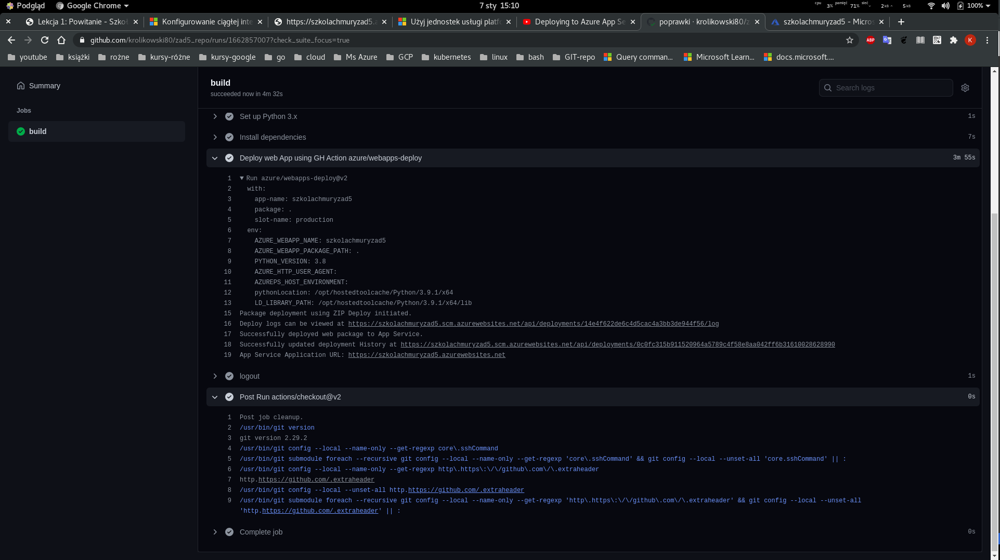

# Zadanie nr 5 
> Wrzuć aplikację na App Service i wykonj auto update z GitHub.
Czyli wykonaj continuous deployment w małej firmie lub garażu, tzn bez Jenkinsów itp.

> Zrobię Pythonowe Heloł Łorld we flasku, wrzucę to na mojgo githuba i wykonam całą automatykę ;>
> Piece of cake

> Od tego ćwiczenia zmienia się moja subskrybjca w Azure z darmowej na Pay-As-You-Go,
 więc zaczynam tobić tanio a nie po prostu robić ;>

# Zacznę od nowego repo w GitHub
```bash
#Tworzę repo lokalnie w portalu już istnieje 
mkdir zad5_repo && cd zad5_repo && git init
git remote add origin git@github.com:krolikowski80/zad5_repo.git
git branch -M main 
git push -u origin main

#Tworzę prostego flaska
touch app.py .gitignore README.md requirements.txt

#Virtual env
pyenv virtualenv 3.9.1 zadanie5 && pyenv local zadanie5

#Ładnie i hakersko ;>
(zadanie5) [20:19][tomasz@lapek][~/local_repo/zad5_repo] (main) $ 

#app.py
    from flask import Flask
    app = Flask(__name__)
    @app.route('/')
    def hello():
        return "Hello Azure, działam i jestem wersją 1!"
    if __name__ == '__main__':
        app.run()

pip install flask
pip freeze > requirements.txt

#Commit
git add .
git commit . -m 'flask_demo_ver01'
git push
```

## Azure App Service	
### Pierwsze wdrożenie - fajnie i szybko można to zrobić z VSC ale do ćwiczeń za łatwo ;>

```bash
#Zmienne
export myResourceGroup=zadanie5tk
export location=germanywestcentral

export planName=myAppServicePlan
export appName=szkolachmuryzad5

# Wdrażam smpla
az webapp up \
--resource-group $myResourceGroup \
--plan $planName \
--sku F1 \
--name $appName \
--location $location
# Wynik 
    The webapp 'szkolachmuryzad5' doesn't exist
    Creating Resource group 'zadanie5tk' ...
    Resource group creation complete
    Creating AppServicePlan 'myAppServicePlan' ...
    Creating webapp 'szkolachmuryzad5' ...
    Configuring default logging for the app, if not already enabled
    Creating zip with contents of dir /home/tomasz/local_repo/zad5_repo ...
    Getting scm site credentials for zip deployment
    Starting zip deployment. This operation can take a while to complete ...
    Deployment endpoint responded with status code 202
    You can launch the app at http://szkolachmuryzad5.azurewebsites.net
```

<details>
  <summary><b><i>Lata aż miło</i></b></summary>


</details>

```bash
# A na jakim Pythoniw w ogóle pracuje?
az webapp config show \
--resource-group $myResourceGroup \
--name $appName \
--query linuxFxVersion

    "PYTHON|3.7"

#Pokaż wszystkie wersje języka Python, które są obsługiwane w Azure App Service
az webapp list-runtimes --linux | grep PYTHON

    "PYTHON|3.8",
    "PYTHON|3.7",
    "PYTHON|3.6",

#EEEE no trzeba zmienić na 3.8 ;>
az webapp config set \
--resource-group $myResourceGroup \
--name $appName \
--linux-fx-version "PYTHON|3.8"
#To jest żle zrobione. set'sy robi się przed deploymentem
```

### Prosta wersja CI/CD

```bash
# Najpierw ręczna aktualizacja 
# zmiana app.py i deploy
# Poprawki do wersji Pythona. Inaczej znowu zmieni na 3.7
# Wersje Pytonga trzeba było sprawdzać i ustawiać przed pierwszym wdroźeniem.
az webapp up --runtime "PYTHON|3.8"

#wynik
    Webapp 'szkolachmuryzad5' already exists. The command will deploy contents to the existing app.
    Creating AppServicePlan 'myAppServicePlan' ...
    Creating zip with contents of dir /home/tomasz/local_repo/zad5_repo ...
    Getting scm site credentials for zip deployment
    Starting zip deployment. This operation can take a while to complete ...
    Deployment endpoint responded with status code 202
    You can launch the app at http://szkolachmuryzad5.azurewebsites.net
    {
    "URL": "http://szkolachmuryzad5.azurewebsites.net",
    "appserviceplan": "myAppServicePlan",
    "location": "germanywestcentral",
    "name": "szkolachmuryzad5",
    "os": "Linux",
    "resourcegroup": "zadanie5tk",
    "runtime_version": "PYTHON|3.8",
    "runtime_version_detected": "-",
    "sku": "FREE",
    "src_path": "//home//tomasz//local_repo//zad5_repo"
    }
```
<details>
  <summary><b><i>Ręczny update</i></b></summary>


</details>

### Wdrażanie w usłudze App Service przy użyciu funkcji GitHub Actions
### konfigurowanie przepływu pracy
```bash
#Zmienne
echo "export subscr=$(az account subscription list --query [].subscriptionId -o tsv)" >> .var 

# Poświadczenia wdrożenia - wystawione tyljo dla tej aplikacji.
# W wielu tutorialach można spotkać wystawianie poświadczń dla całeg Resource Grupy alb innych szerszych miejsc. J a jednak wolę skąpo nadawać uprawnienie wg zasady "Tylko tyle ile trzeba"
az ad sp create-for-rbac \
--name $appName \
--role contributor \
--scopes /subscriptions/$subscr/resourceGroups/$myResourceGroup/providers/Microsoft.Web/sites/$appName \
--sdk-auth

# Wynik w dżejsonie skopiowałem do: https://github.com/krolikowski80/zad5_repo/settings/secrets/actions/new


#Workflow file
mkdir -p ~/local_repo/zad5_repo/.github/workflows/
touch ~/local_repo/zad5_repo/.github/workflows/main.yml

#main.yml dodany 
https://github.com/krolikowski80/zad5_repo/blob/main/.github/workflows/main.yml

#Zmiany w app.py 
git commit . -m 'poprawki'
git push 

```
<details>
  <summary><b><i>Screen z efektem końcowym</i></b></summary>




</details>

> Zadanie można było wykonać w kilka kliknięć w portalu. Myślę że dev, który to robi zawsze na swoim środowisku, może śmiało konfigurować MS VS lub VSC i robić to właśnie klikająć w iokonki.
