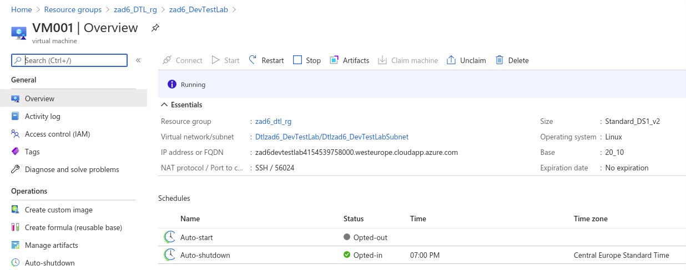
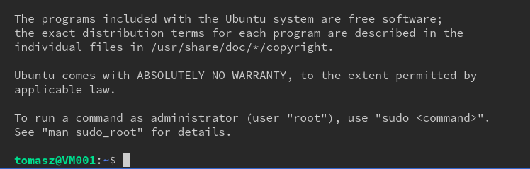
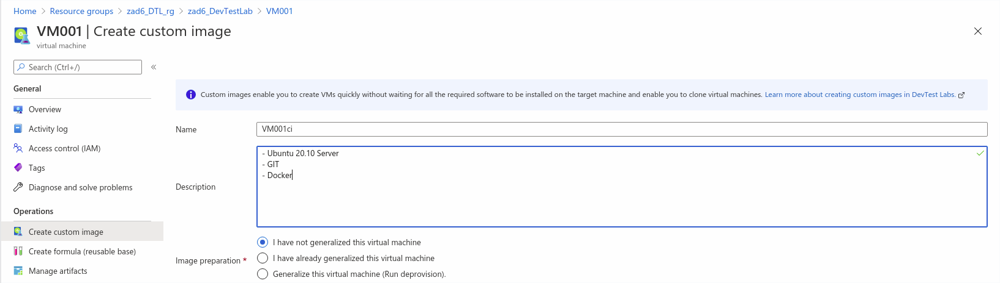
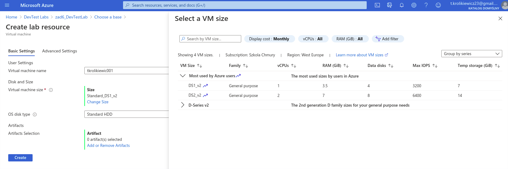
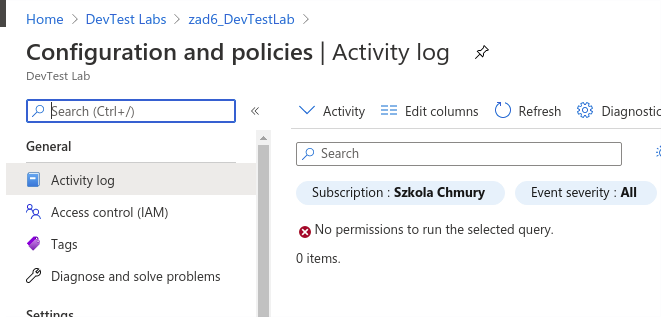

# Zadanie nr 6 - DEvTest Labs

### Zadanie polega na stworzeniu DTL a w nim jednego obrazu VM. Dodaniu zewnętrznego urzytkownika do labsów i zezwoleniu mu na tworzenie VM tylko z tego obrazu. Dokonam też kilku, moim zdaniem, ważnych zmian w ustawieniach DTL.
* Używam plików ARM z https://github.com/Azure/azure-quickstart-templates
> Pewnie można było znaleźć template już z maszyną linuxową. Ale dłużej bym szukał, niż sam stawiał nową VM.
Pewnie można też napisać ARM, który wykona wszystkie te prace za jednym poleceniem. Ja tego na obecną chwilę,  po prostu nie umiem. Więc zacznę rzeczy od prostych.


### Proste Środowisko
```bash
# zmienne 
export myResourceGroup=zad6_DTL_rg
export location=westeurope
export labName=zad6_DevTestLab
export vmName=VM001
export deploymentName='Zad6Deployment'$(date +"%d-%b-%Y")

# Grupa zasobów
az group create \
--name $myResourceGroup \
--location $location

# Wdrażam prosty template 
az deployment group create \
--name $deploymentName \
--resource-group $myResourceGroup \
--template-file ~/local_repo/Szkola_Chmury/Azure/Zrozum_wszystkie_uslugi/zadanie6/templates/template.json \
--parameters @~/local_repo/Szkola_Chmury/Azure/Zrozum_wszystkie_uslugi/zadanie6/templates/parameters.json 
```
#### Podstawowe zmiany w Configuration and policies
* Access control (IAM)
    * Dodaję rolę DevTest Labs User dla zewnętrznego urzytkownika
* Virtual machines per user = 3
* Virtual machines per user = 10
* Lab settings
    * All virtual machines in one resource group = zad6_DTL_rg
    * Reder
* Virtual network
    * Allow public IP creation = NO
* Allow all Azure Marketplace images as virtual machine base images:
    * NO
    * odhaczam wszystko - zostawiam tylko Ubuntu Server 20.10 - (potem dostępna będzie tylko customowa)
* Enable Public Environments for this lab: NO

> Chcę nauczyć się ustawiać to wszystko w ARM'ie 

```bash
#Tworzę VM
az lab vm create \
--lab-name $labName \
--resource-group $myResourceGroup \
--name $vmName \
--image "Ubuntu Server 20.10" \
--image-type gallery \
--size Standard_DS1_v2 \
--authentication-type  ssh \
--generate-ssh-keys \
--ip-configuration shared

# Sprawdzam dostępność maszyny
az lab vm show \
--resource-group $myResourceGroup \
--lab-name $labName \
--name $vmName \
--query '{status: computeVm.statuses[0].displayStatus, fqdn: fqdn}'

# Nie wiem czemu nie zwraca FQDN, nie wiem też jak pobrć port. Więc sprawdziłem w portalu
{
  "fqdn": null,
  "status": null
}
```
<details>
  <summary><b><i>VM Details</i></b></summary>



</details>

```bash
# Zmienne
export vmAdress=zad6devtestlab4154539758000.westeurope.cloudapp.azure.com
export vmPort=56024

# Loguję się na VM
ssh $vmAdress -p $vmPort 
# Działa
```

<details>
  <summary><b><i>Logowanie</i></b></summary>



</details>


```bash
# Dodaję artifacts
az lab vm apply-artifacts \
--lab-name  $labName \
--name $vmName  \
--resource-group $myResourceGroup  \
--artifacts @~/local_repo/Szkola_Chmury/Azure/Zrozum_wszystkie_uslugi/zadanie6/templates/artifacts.json

# Lista artifacts
az lab vm show \
--resource-group $myResourceGroup \
--lab-name $labName \
--name $vmName \
--expand "properties(\$expand=artifacts)" \
--query "artifacts[].{artifactId: artifactId, status: status}"

# wynik
    [
        {
            "artifactId": "/subscriptions/4c18ac9c-3885-4370-baf7-bf15e9c3f783/resourceGroups/zad6_DTL_rg/providers/Microsoft.DevTestLab/labs/zad6_DevTestLab/artifactSources/public repo/artifacts/linux-install-docker",
            "status": "Succeeded"
        },
        {
            "artifactId": "/subscriptions/4c18ac9c-3885-4370-baf7-bf15e9c3f783/resourceGroups/zad6_DTL_rg/providers/Microsoft.DevTestLab/labs/zad6_DevTestLab/artifactSources/public repo/artifacts/linux-apt-package",
            "status": "Succeeded"
        }
    ]
```

#### Obraz VM (Portal)
* tworzę obraz na podstawie istniejącej VM
* wyłączam ostatni obraz publiczny (Ubuntu)
* pozostawiam custom images

<details>
  <summary><b><i>Create custom image</i></b></summary>



</details>

#### TESTY
* loguję się kontem drugiego usera i stawiam VM
    * Działa

        * Pan Królikiewicz może jedynie działać w obrębie danego DevTest Labs, widzi tylko swoje VM i ma możliość stawiania ich tylko z mojego obrazu.

<details>
  <summary><b><i>Pan królikiewicz tworzy VM i nie ma innego dostępu</i></b></summary>





</details>

### Sprzątam
```bash
# delete grupy
az group delete \
--name $myResourceGroup
```
> Nie jestem do końca zadowolony z tego wykonania. To pokazuje jak jeszcze wiele nauki przede mną.

