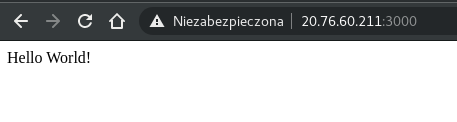

# Implementing containers in Azure
> LAB Overview
> This lab introduces you to containers functionality and services available in Azure for containers.

### Create Docker Image

<details>
  <summary><b><i>package.json</i></b></summary>

```json

{
    "name": "containerapp",
    "version": "1.0.0",
    "description": "ContainerApp demo",
    "main": "index.js",
    "scripts": {
        "start": "node index.js",
        "test": "echo \"Error: no test specified\"&& exit 1"
    },
    "author": "Chmurowisko",
    "license": "ISC",
    "dependencies": {
        "express": "^4.16.3"
    }
}

```

</details>

<details>
  <summary><b><i>index.js</i></b></summary>

```js
const express = require('express');
const app = express();
app.get('/', (req, res) => res.send('Hello World!'));
app.listen(3000, () => console.log('Example app listening on port 3000!'));
```

</details>

```bash
# Test i start
npm install
npm start
```

<details>
  <summary><b><i>Dockerfile</i></b></summary>

```bash
FROM node:carbon
WORKDIR /usr/src/app
COPY package*.json ./
COPY index.js ./
RUN npm install
EXPOSE 3000
ENTRYPOINT [ "npm","start" ]
```
</details>

```bash
#Zmienne AZ
export myResourceGroup=zjazd3-szkchm-rg
export locate=westeurope
export containerRegistryName=AZ304registry34

# Tworzę grupę zasobów
az group create \
> -n $myResourceGroup \
> -l $locate 

# Tworzę swoje prywatne repo na ACR
# Parameter 'registry_name' must conform to the following pattern: '^[a-zA-Z0-9]*$'.
az acr create --resource-group $myResourceGroup \
--name $containerRegistryName \
--sku Basic

# Włączam konto administratora rejestru
az acr update -n $containerRegistryName \
--admin-enabled true

# Pobieram nazwę użytkownika i hasło do konta administratora
az acr credential show \
--name $containerRegistryName \
-o table

  USERNAME         PASSWORD                          PASSWORD2
  ---------------  --------------------------------  --------------------------------
  AZ304registry34  l55Q9MjBPnEnd6+eZ/1dou0JOlPwPqfR  gLrbk=Qsk270l3Lui6iI8X3ud4yJZ+no

# Zmienne
export userName=AZ304registry34
export registryPassword=l55Q9MjBPnEnd6+eZ/1dou0JOlPwPqfR
export loginServer=az304registry34.azurecr.io

# Build image
docker build –t containerapp .

# Test kontenera
docker run -p 3000:3000 ccontainerapp

# docker login
docker login \
-p $registryPassword \
-u $userName \
$loginServer

#Taguję obraz <registry-name>.azurecr.io
docker tag containerapp:latest $loginServer/containerapp

# obraz na ACR
docker push $loginServer/containerapp 
```

### Create Azure Container Services using Kubernetes.

```bash
# Loguję się jako student student34@szkolachmurylab.onmicrosoft.com
az login

# Tworzę klaster
az aks create \
--resource-group $myResourceGroup \
--name AZ304Cluster34 \
--node-vm-size Standard_A5 \
--node-count 1 \
--generate-ssh-keys

# Pobieram uprawnienia
az aks get-credentials \
--resource-group RG-AZ304-34 \
--name AZ304Cluster34

# Create secret for ACR
k create secret docker-registry azuresecret \
--docker-server $loginServer \
--docker-email t.krolikowski@gmail.com \
--docker-username=$userName \
--docker-password $registryPassword
```

### Create deployment file and deploy it
<details>
  <summary><b><i>deployment.yaml</i></b></summary>

```yaml
apiVersion: apps/v1
kind: Deployment
metadata:
  name: containerapp
  labels:
    app: containerapp
spec:
  replicas: 1
  selector:
    matchLabels:
      app: containerapp
  template:
    metadata:
      labels:
        app: containerapp
    spec:
      containers:
        - name: containerapp
          image: az304registry34krolik.azurecr.io/containerapp
          ports:
            - containerPort: 3000
      imagePullSecrets:
        - name: azuresecret
```

</details>

```bash
# Deploy
k create -f deployment.yam

# Verify status
kubectl get pods

    NAME                            READY   STATUS    RESTARTS   AGE
    containerapp-745c9c4cb6-wvqjq   1/1     Running   0          6m
```

<details>
  <summary><b><i>deployment.yaml</i></b></summary>

```yaml
apiVersion: apps/v1
kind: Deployment
metadata:
  name: containerapp
  labels:
    app: containerapp
spec:
  replicas: 1
  selector:
    matchLabels:
      app: containerapp
  template:
    metadata:
      labels:
        app: containerapp
    spec:
      containers:
        - name: containerapp
          image: az304registrykrolik.azurecr.io/containerapp
          ports:
            - containerPort: 3000
      imagePullSecrets:
        - name: azuresecret
---
apiVersion: v1
kind: Service
metadata:
  name: containerappservice
spec:
  type: LoadBalancer
  ports:
    - port: 3000
  selector:
    app: containerapp
```
</details>

```bash
# aplay
k apply -f deployment.yaml

# Verify status
k get services
    
    NAME                  TYPE           CLUSTER-IP     EXTERNAL-IP    PORT(S)          AGE
    containerappservice   LoadBalancer   10.0.176.167   20.76.27.56   3000:30315/TCP   29s 
    kubernetes            ClusterIP      10.0.0.1       <none>         443/TCP          119m
```
<details>
  <summary><b><i>Lata aż miło</i></b></summary>

