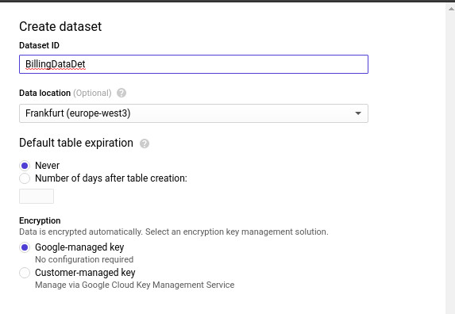
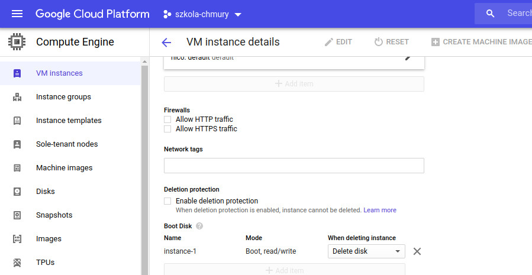

# [Zadanie domowe nr 2](https://szkolachmury.pl/google-cloud-platform-droga-architekta/tydzien-2-podstawy-pracy-z-gcp/zadanie-domowe-nr-2/)

# Billing

### 1. Eksport danych rozliczeniowych do BigQuery

#### 1.1 Utworzenie Dataset z BigQuery

<details>
  <summary><b><i>Pokaż</i></b></summary>



</details>

#### 1.2 Eksport bilingu do BigQuery

<details>
  <summary><b><i>Pokaż</i></b></summary>


</details>

### 2. Eksport danych rozliczeniowych do pliku

#### 2.1 Utworzenie Bucketa w Cloud Storage

<details>
  <summary><b><i>Pokaż</i></b></summary>


</details>

#### 2.1 Eksport danych do pliku CSV

<details>
  <summary><b><i>Pokaż</i></b></summary>


</details>

# Compute Engine

### 3.1 Utworzenie oraz uruchamianie instancji

<details>
  <summary><b><i>Pokaż</i></b></summary>


</details>

### 3.2 Odłączenie dysku startowego

<details>
  <summary><b><i>Pokaż</i></b></summary>




</details>

### 3.3 Ponowne podłączenie dysku startowego

<details>
  <summary><b><i>Pokaż</i></b></summary>


</details>

### 3.4 Snapshot dysku

<details>
  <summary><b><i>Pokaż</i></b></summary>


</details>

### 3.5 Przenoszenie instancji pomiędzy strefami

```bash
gcloud compute instances move instance-1 --zone europe-west3-b --destination-zone europe-west3-a
Moving gce instance instance-1...done.
```