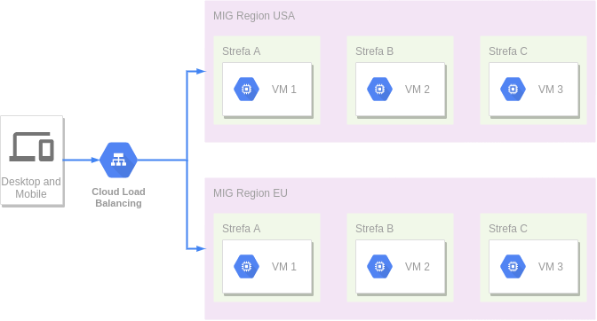
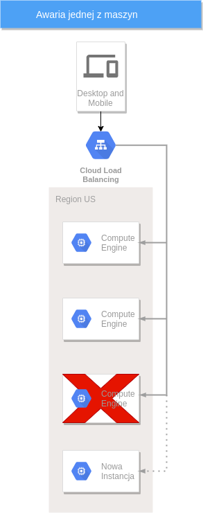
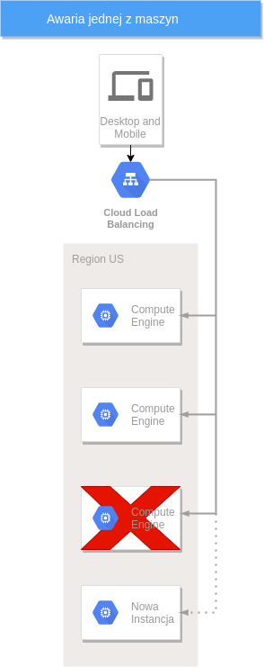
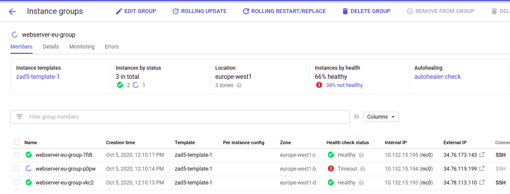
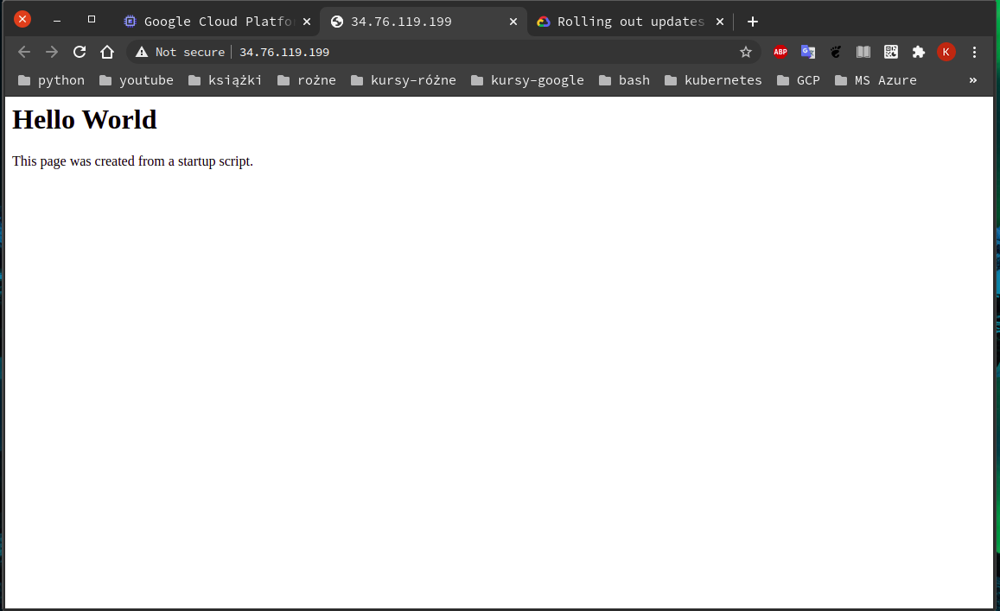

# [Zadanie 4](https://szkolachmury.pl/google-cloud-platform-droga-architekta/tydzien-5-instance-groups-i-autoskalowanie/zadanie-domowe-nr-5/)

Zarząd MountKirk zdecydował, że wypuszczając swoją nową grę na rynek skorzystają z gotowego rozwiązania w Google Cloud jakim jest Compute Engine. firma postanowiła również wprowadzić nową aplikację dla graczy, którą również chcą oprzeć na tym rozwiązaniu.

Gra okazała się wielkim sukcesem, a aplikacja również przyniosła oczekiwane rezultaty. Firma nie spodziewała się, aż tak wielkiej ilości nowych osób z całego świata, którzy będą chcieli skorzystać z nowych funkcjonalności. W pewnym momencie całe środowisko stało się mało wydajne i użytkownicy końcowi zaczęli dostrzegać, że platformie doskwierają jakieś problemy.

Specjaliści starali się zwiększać na bieżąco parametry maszyn wirtualnych, aby podnieść wydajność, lecz było to mało efektowne oraz zajmowało masę czasu, dlatego firma postanowiła ponownie zgłosić się do Ciebie!

>MountKirk Games poprosiło cię, abyś przeprojektował aktualną architekturę, która będzie obejmowała nowe wytyczone firmowe standardy:

1. Na ten moment firma nie może zrezygnować z maszyn wirtualnych, dlatego nowa architektura musi korzystać z wirtualnych maszyn postawionych z niestandardowego obrazu, dostarczonego bezpośrednio przez firmę.

2. Rozwiązanie musi dynamicznie skalować się w górę lub w dół w zależności od aktywności w grze - bez większej ingerencji specjalistów

3. Gracze korzystający z funkcjonalności firmy pochodzą z całego świata, a w szczególności z Stanów Zjednoczonych oraz Europy. Poprzez odpowiednie umiejscowienie rozwiązania MountKirk chce zredukować opóźnienie jakie występuje dla osób łączących się z US.

4. Rozwiązanie musi zapobiegać jakiejkolwiek przerwie w dostarczaniu funkcjonalności na wypadek awarii np. regionu Google Cloud.

5. Rozwiązanie musi umożliwość łatwe i bezpiecznie wdrażanie nowych wersji oprogramowania do instancji bez konieczności wpływania na całe środowisko.

# 1. Opis zastosowanych rozwiązań do podanych wyżej zagadnień

1. Firma potrzebuje floty maszyn wirtualnych. Na chwilę obecną najlepszym rozwiązaniem będzie zastowowanie Managed Instance Groups (MIG), które pozwoli w łatwy sposób zarządzać wieloma maszynami jednocześnie.

2. Autoskalowanie - MIG obsługują automatyczne skalowanie, które dynamicznie dodaje lub usuwa instancje z MIG w odpowiedzi na wzrost lub spadek obciążenia. Zasady automatycznego skalowania obejmują między innymi:
    - skalowanie na podstawie wykorzystania procesora 
    - lub zdolności równoważenia obciążenia.
3. Żeby zapewnić szybszy dostęp do aplikacji klientom z różnych części świata zastosuję  regionalne MIG, które rozmieszczą instancje w wielu strefach w tym samym regionie.
    - Będą to dwie osobne MIG dla regionów USA i EU

<details>
  <summary><b><i>Rozmieszczenie VM</i></b></summary>


</details><br>

4. Autohealing - W przypadku awarii aplikacji lub instancji VM zostanie ona automatycznie usunięta i odtworzona na nowo.
<details>
  <summary><b><i>Autohealing</i></b></summary>


</details><br>
5. Przy wdrażaniu nowych wersji zastosowany będzie canary testing. Czyli na samym początku wymienimy tylko jedną VM, w jednej strefie. Jeżeli nowa wersja okaże się sprawną, można przystąpić do wymiany reszty. Dzięki takiemu rozwiązaniu unikniemy kłopotów na wielką skale. Nie udane update będzię można bardzo szybko przywrócić do poprzedniego stanu, nie zakłócając pracy reszty VM.
<details>
  <summary><b><i>Wzorzec aktualizacji</i></b></summary>


</details><br>

# PoC w Cloud SDK
```bash
# Zmienne
# Dla ułatwienia pracy, wszystkie nazwy zasobów umieszczam jako zmiene w pliku ".gcp_zad5_var". Plik ten jest ładowany przy każdym logowaniu.
cat .gcp_zad5_var

export projectID=szkola-chmury-tk
export account=t.krolikowski@gmail.com

#Dla template
export template1=zad5-template-1
export template2=zad5-template-2


cat ~/.bashrc
.... 
# załącz plik do .bashrc jeśli istnieje
if [ -f ~/my_repos/Szkola_Chmury/GCP_architekt/zadanie5/.gcp_zad5_var ]; then
    . ~/my_repos/Szkola_Chmury/GCP_architekt/zadanie5/.gcp_zad5_var
fi
....
```

#### [1. Tworzę szabllony dla grup instancji](https://cloud.google.com/compute/docs/instance-templates/create-instance-templates)
```bash
#podstawowy template dla EU/USA
gcloud compute instance-templates create $template1 \
    --machine-type e2-micro \
    --tags http-server \
    --metadata-from-file startup-script=files/health_scr.sh

#aktualizacja dla EU/USA
gcloud compute instance-templates create $template2 \
    --machine-type e2-micro \
    --tags=http-server \
    --metadata-from-file startup-script=files/apahe_scr.sh

#Sprawdzam
gcloud compute instance-templates list 

```
#### [2. Tworzę healthcheck](https://cloud.google.com/load-balancing/docs/health-checks)
#### [ - Dodatkowa dokumentacja - autohealing](https://cloud.google.com/compute/docs/tutorials/high-availability-autohealing)

```bash
#Zmienne
echo $'\n#Dla autohealing\nexport healthChecker=autohealer-check' >> .gcp_zad5_var && source .gcp_zad5_var

#Tworzę regóły sprawdzania
gcloud compute health-checks create http $healthChecker \
    --check-interval 10 \
    --timeout 5 \
    --healthy-threshold 2 \
    --unhealthy-threshold 3 \
    --request-path "/health"

#Sprawdzam
gcloud compute health-checks list 
NAME              PROTOCOL
autohealer-check  HTTP

#Tworzęz regułę zapory, aby umożliwić sondom kontroli stanu wysyłanie żądań HTTP.
gcloud compute firewall-rules create default-allow-http-health-check \
    --network default \
    --allow tcp:80 \
    --source-ranges 130.211.0.0/22,35.191.0.0/16
    
```
#### [3. Tworzę MIG z 3 maszyn wg szablonu dla USA i EU](https://cloud.google.com/compute/docs/instance-groups/creating-groups-of-managed-instances)
```bash
#Zmienne
echo $'\n#Dla MIG\nexport migEUname=webserver-EU-group\nexport migEUregion=europe-west1' >>.gcp_zad5_var
echo $'\nexport migUSname=webserver-US-group\nexport migUSregion=us-central1' >>.gcp_zad5_var && source .gcp_zad5_var

#Tworzę grupę instancji z włączonym autohealingiem
gcloud compute instance-groups managed create $migEUname \
    --region $migEUregion \
    --template $template1 \
    --size 3 \
    --health-check $healthChecker \
    --initial-delay 120

#Monitoruję stan grupy instancji. (Po zakończeniu zatrzymaj, naciskając Ctrl + C.)
while : ; do \
    gcloud compute instance-groups managed list-instances $migEUname \
    --region $migEUregion \
    ; done
```

#### [4. Test health](https://cloud.google.com/compute/docs/tutorials/high-availability-autohealing#simulate_health_check_failures)
```bash
#Sprawdzam adresy instancji w grupie
gcloud compute instances list --filter $migEUname

#pobieram adres, ale exportuję tylko tymczasowo (bez zapisywania w pliku)
export ip_adress_1=34.76.173.143
export ip_adress_2=35.195.82.168
export ip_adress_3=34.78.113.110

#Sprawdzam, czy serwer WWW zakończył konfigurację. Serwer zwraca odpowiedź HTTP 200 OK.
curl --head $ip_adress_1/health
curl --head $ip_adress_2/health
curl --head $ip_adress_3/health

#Symuluje awarię/niedostępnmość maszyny.
curl $ip_adress_1/makeUnhealthy > /dev/null

#Wynik
curl --head $ip_adress_1/health

HTTP/1.1 500 INTERNAL SERVER ERROR
Server: gunicorn/19.9.0
Date: Mon, 05 Oct 2020 10:31:15 GMT
Connection: close
Content-Type: text/html; charset=utf-8
Content-Length: 133
```
<details>
  <summary><b><i>Awaria / niedostępność maszyny</i></b></summary>


</details><br>

```bash
#Czekam aż maszyna się odbuduje
while : ; do \
    gcloud compute instance-groups managed list-instances $migEUname \
    --region $migEUregion \
    ; done

NAME                     ZONE            STATUS   HEALTH_STATE  ACTION  INSTANCE_TEMPLATE  VERSION_NAME  LAST_ERROR
webserver-eu-group-p0pw  europe-west1-b  RUNNING  HEALTHY       NONE    zad5-template-1
webserver-eu-group-7fdt  europe-west1-c  RUNNING  HEALTHY       NONE    zad5-template-1
webserver-eu-group-vkc2  europe-west1-d  RUNNING  HEALTHY       NONE    zad5-template-1

#Sprawdzam ponownie dresy instancji w grupie. 1 Instancja ma nowy nr ip
gcloud compute instances list --filter $migEUname

NAME                     ZONE            MACHINE_TYPE  PREEMPTIBLE  INTERNAL_IP    EXTERNAL_IP     STATUS
webserver-eu-group-p0pw  europe-west1-b  e2-micro                   10.132.15.203  104.199.40.115  RUNNING
webserver-eu-group-7fdt  europe-west1-c  e2-micro                   10.132.15.202  35.195.82.168   RUNNING
webserver-eu-group-vkc2  europe-west1-d  e2-micro                   10.132.15.200  34.78.113.110   RUNNING

#Zmieniam ip_adress_1
export ip_adress_1=104.199.40.115
```
#### [4. Ustawienia i test autoscaling](https://cloud.google.com/compute/docs/autoscaler/scaling-cpu)
```bash
#Włączam autoscaling
gcloud compute instance-groups managed set-autoscaling $migEUname \
    --max-num-replicas 4 \
    --min-num-replicas 1 \
    --target-cpu-utilization 0.60 \
    --cool-down-period 90 \
    --region $migEUregion

#Z nieznanych mi przyczyn maszyny dosyć często się odbudowują.
#Więc sprawdzę jeszcze raz jakie mają nr IP
gcloud compute instances list --filter $migEUname
export ip_adress_1=34.76.173.143
#Jak widać, po ustawieniu autoskalowania z wartościoą --min-num-replicas 1 po paru minutach GCP wyskalowało sysyem do 1 maszyny

#Pobieram nazwę projektu
export PROJECT_ID=szkola-chmury-tk

#Ten skrypt obciąży maszynę
export MACHINES=$(gcloud --project=$PROJECT_ID compute instances list --format="csv(name,networkInterfaces[0].accessConfigs[0].natIP)" | grep $migEUname)
for i in $MACHINES;
do
  NAME=$(echo "$i" | cut -f1 -d,)
  IP=$(echo "$i" | cut -f2 -d,)
  echo "Simulating high load for instance $NAME"
  curl -q -s "http://$IP/starttLoad" >/dev/null --retry 2
done

...
Simulating high load for instance webserver-eu-group-7fdt
...

#Sprawdzam co sie dzieje
while : ; do \
    gcloud compute instance-groups managed list-instances $migEUname \
    --region $migEUregion \
    ; done

#Wynik
NAME                     ZONE            STATUS   HEALTH_STATE  ACTION  INSTANCE_TEMPLATE  VERSION_NAME  LAST_ERROR
webserver-eu-group-nm8g  europe-west1-b  RUNNING  HEALTHY       NONE    zad5-template-1
webserver-eu-group-7fdt  europe-west1-c  RUNNING  HEALTHY       NONE    zad5-template-1
webserver-eu-group-pcsd  europe-west1-c  RUNNING  HEALTHY       NONE    zad5-template-1
webserver-eu-group-r66j  europe-west1-d  RUNNING  HEALTHY       NONE    zad5-template-1

#Zmieniam w skrypcie "start na stop load"
export MACHINES=$(gcloud --project=$PROJECT_ID compute instances list --format="csv(name,networkInterfaces[0].accessConfigs[0].natIP)" | grep $migEUname)
for i in $MACHINES;
do
  NAME=$(echo "$i" | cut -f1 -d,)
  IP=$(echo "$i" | cut -f2 -d,)
  echo "Simulating low load for instance $NAME"
  curl -q -s "http://$IP/stopLoad" >/dev/null --retry 2
done

...
Simulating high load for instance webserver-eu-group-nm8g
Simulating high load for instance webserver-eu-group-7fdt
Simulating high load for instance webserver-eu-group-pcsd
Simulating high load for instance webserver-eu-group-r66j

#po około 10 min:
gcloud compute instances list --filter $migEUname
NAME                     ZONE            MACHINE_TYPE  PREEMPTIBLE  INTERNAL_IP    EXTERNAL_IP    STATUS
webserver-eu-group-7fdt  europe-west1-c  e2-micro                   10.132.15.220  34.76.119.199  RUNNING
```

#### [6. Canary update](https://cloud.google.com/compute/docs/instance-groups/rolling-out-updates-to-managed-instance-groups#canary_updates)
```bash
# Wyłączenie autohealing
gcloud compute instance-groups managed update $migEUname \
    --region $migEUregion \
    --clear-autohealing

# Wyłączenie autoskalowania
gcloud compute instance-groups managed stop-autoscaling $migEUname \
    --region $migEUregion

#Ustawiam ilość instancji na 4
gcloud compute instance-groups managed resize $migEUname \
    --region $migEUregion \
    --size 4

#Tworzę canary update dla 1 instancji
gcloud compute instance-groups managed rolling-action start-update $migEUname \
--version template=$template1 \
--canary-version template=$template2,target-size=25% \
--region $migEUregion

#Wynik
NAME                     ZONE            STATUS   HEALTH_STATE  ACTION  INSTANCE_TEMPLATE  VERSION_NAME  LAST_ERROR
webserver-eu-group-2mq1  europe-west1-b  RUNNING                NONE    zad5-template-1
webserver-eu-group-lmkq  europe-west1-c  RUNNING                NONE    zad5-template-2
webserver-eu-group-vqv0  europe-west1-c  RUNNING                NONE    zad5-template-1
webserver-eu-group-95r8  europe-west1-d  RUNNING                NONE    zad5-template-1

#ZAktualizuję resztę instancji za pomocą nowego szablonu
gcloud compute instance-groups managed rolling-action start-update $migEUname \
    --version template=$template2 \
    --max-unavailable 100% \
    --region $migEUregion

ERROR: (gcloud.compute.instance-groups.managed.rolling-action.start-update) Could not fetch resource:
 - Invalid value for field 'resource.updatePolicy.maxUnavailable.percent': '100'. Percent updatePolicy.maxUnavailable for regional managed instance group is only allowed for regional managed instance groups with size at least 10.

#Dla MIG regionalnych, nie da się ustawić flagi --max-unavailable na wartośc 100% dla grup poniżej 10 maszyn 
# Nie da się ustawić żadnje wartości dla tej flagi.

#Jeszcze raz
gcloud compute instance-groups managed rolling-action start-update $migEUname \
    --version template=$template2 \
    --region $migEUregion

#Wynik
gcloud compute instance-groups managed list-instances $migEUname \
    --region $migEUregion

NAME                     ZONE            STATUS   HEALTH_STATE  ACTION  INSTANCE_TEMPLATE  VERSION_NAME  LAST_ERROR
webserver-eu-group-7j74  europe-west1-b  RUNNING                NONE    zad5-template-2
webserver-eu-group-jcnf  europe-west1-c  RUNNING                NONE    zad5-template-2
webserver-eu-group-lmkq  europe-west1-c  RUNNING                NONE    zad5-template-2
webserver-eu-group-qb3q  europe-west1-d  RUNNING                NONE    zad5-template-2
```
<details>
  <summary><b><i>Wynik update</i></b></summary>


</details><br>
