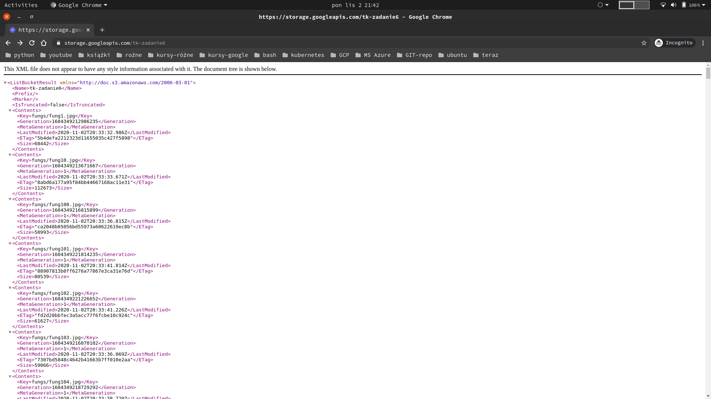
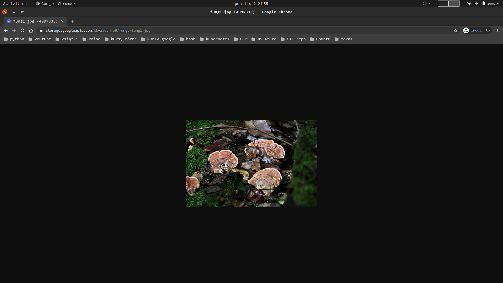

# [Zadanie 6](https://szkolachmury.pl/google-cloud-platform-droga-architekta/tydzien-6-cloud-storage/zadanie-domowe-nr-6/)

- Pobierz dane ze wskazanego linku na swój komputer / maszynę wirtualną w chmurze.
https://storage.googleapis.com/testdatachm/sampledata/imagedata.tar.gz
- Rozpakuj zdjęcia.
- Stwórz odpowiednie konto storage.
- Skopiuj dane z zachowaniem struktury katalogów (najlepiej w trybie równoległym).
- Stwórz odpowiednią metodę dostępu do plików dla zewnętrznej firmy, tak aby mogli dostać się do plików bez konieczności zakładania dedykowanych kont.
- Wprowadź odpowiednie zasady zarządzania cyklem zycia plików, tak aby spełniały wymagania zawarte poniżej.
    - po 60 dniach pliki będą przenoszone do tańszego storage'a (Nearline)
    - po 90  dziach usuwane
      - soft-delete, który pozwala jeszcze do 10 dni po usunięciu pliku na jego odzyskanie
---
>Oczywiście zacznę od stworzenia pliku dla zmiennych i automatycznego go ładowania w .bashrc

Potrzebne zasoby:
- bucket
- VM dla admina (pozoracja środowiska on prem firmy) oraz service account do obsługi.
- Odpowiednie uprawnienia do odczyt/zapis dla VM firmy i tylko odczyt dla całej reszty
  - https://cloud.google.com/storage/docs/access-control/
  - https://cloud.google.com/storage/docs/access-control/making-data-public#gsutil_1
    - Dostęp do tego łącza nie wymaga uwierzytelniania. Nadaje się na przykład jako łącze na stronie internetowej lub do pobrania za pomocą narzędzia wiersza poleceń, takiego jak cURL.
      - https://storage.googleapis.com/BUCKET_NAME/OBJECT_NAME

---
### 1. Utworzenie bucketa
```bash
#Zmienne
export bucketName=tk-zadanie6
export bucketLocation=EUR4

#Tworzę Bucket
gsutil mb -l $bucketLocation gs://${bucketName}
```
### 3. Utworzenie SA, nadanie mu odpowiednich praw i oddanie mu VM pod kontrolę 
```bash
#Zmienne
export saName="adminserviceaccount"
export saDesc="Service account dający pełen dostęp do bucketa adminowi w firmie"
export saDisp="Bucket Administrator Service Account"
export saEmail="adminserviceaccount@szkola-chmury-tk.iam.gserviceaccount.com" #gcloud iam service-accounts list

#Tworzę SA
gcloud iam service-accounts create $saName \
--description "$saDesc" \
--display-name "$saDisp"

#Pobieram nazwę
gcloud iam service-accounts list
    adminserviceaccount@szkola-chmury-tk.iam.gserviceaccount.com

#Przydział prawa RW do danego stgorage
gsutil iam ch serviceAccount\
:$saEmail\
:roles/storage.objectAdmin \
gs://${bucketName}

#A całej reszcie userów nadaję prawa odzczytu dla bucketa (set bucket public)
gsutil iam ch allUsers:objectViewer gs://$bucketName

#pobieram politykę
gsutil iam get gs://$bucketName > roles.json
```
<details>
  <summary><b><i>roles.json</i></b></summary>

```json
{
  "bindings": [
    {
      "members": [
        "projectEditor:szkola-chmury-tk",
        "projectOwner:szkola-chmury-tk"
      ],
      "role": "roles/storage.legacyBucketOwner"
    },
    {
      "members": [
        "projectViewer:szkola-chmury-tk"
      ],
      "role": "roles/storage.legacyBucketReader"
    },
    {
      "members": [
        "serviceAccount:adminserviceaccount@szkola-chmury-tk.iam.gserviceaccount.com"
      ],
      "role": "roles/storage.objectAdmin"
    },
    {
      "members": [
        "allUsers"
      ],
      "role": "roles/storage.objectViewer"
    }
  ],
  "etag": "CAM="
}
```
</details><br>

### 2. Utworzenie VM
```bash
# Zmienne
export vmName=vm-admin-zad6
export vmZone=europe-west2-b
export vmType="f1-micro"

#Tworzę VM
gcloud compute instances create $vmName \
--zone=$vmZone \
--machine-type=$vmType \
--service-account=$saEmail \
--scopes https://www.googleapis.com/auth/devstorage.read_write
```

### 3. Test uprawnień

```bash
#Loguję się na VM i sprawdzam uprawnienia
gcloud compute ssh  $vmName \
--zone=$vmZone

#Sprawdzam listę bucketów
gsutil ls

  AccessDeniedException: 403 adminserviceaccount@szkola-chmury-tk.iam.gserviceaccount.com does not have storage.buckets.list access to the Google Cloud project.

#Instaluję wget
sudo apt install wget -y

#Pobieram przykładowe dane
wget https://storage.googleapis.com/testdatachm/sampledata/imagedata.tar.gz

#Rozpakowuję dane
tar -zxvf imagedata.tar.gz

#Kopiuję pliki równolegle (wielowątkowo) z zachowaniem struktury katalogów
gsutil -m cp -r testdatachm/** gs://tk-zadanie6/

  - [964/964 files][ 73.6 MiB/ 73.6 MiB] 100% Done   2.2 MiB/s ETA 00:00:00       
  Operation completed over 964 objects/73.6 MiB.         

#lista plików
gsutil ls gs://tk-zadanie6/

  gs://tk-zadanie6/fungs/
  gs://tk-zadanie6/garden/
  gs://tk-zadanie6/homeplants/
  gs://tk-zadanie6/rocks/

#A na inny bucket? - koiuję jeden, przykładowy plik
gsutil cp testdatachm/fungs/fung145.jpg gs://billing_bucket_tk/

  Copying file://testdatachm/fungs/fung145.jpg [Content-Type=image/jpeg]...
  AccessDeniedException: 403 adminserviceaccount@szkola-chmury-tk.iam.gserviceaccount.com does not have storage.objects.create access to the Google Cloud Storage object
```
<details>
  <summary><b><i>Widok pliku XML w przeglądarce (Okno Incognito)</i></b></summary>


</details><br>

---

<details>
  <summary><b><i>Podgląd jednego z udostępnionych plików w nprzeglądarce (Okno Incognito)</i></b></summary>


</details><br>
### 3. Polityka życia plików
```bash
#Ustawiem wersjonowanie
gsutil versioning set on gs://$bucketName

#Zobaczy co mamy
gsutil lifecycle get gs://$bucketName

  gs://tk-zadanie6/ has no lifecycle configuration.  #Czyli nic ;>
```
<details>
  <summary><b><i>lifecycle.json</i></b></summary>

```json
{
    "lifecycle": {
        "rule": [
            {
                "action": {
                    "type": "SetStorageClass",
                    "storageClass": "NEARLINE"
                },
                "condition": {
                    "age": 60,
                    "matchesStorageClass": [
                        "MULTI_REGIONAL",
                        "STANDARD",
                        "DURABLE_REDUCED_AVAILABILITY"
                    ]
                }
            },
            {
                "action": {
                    "type": "Delete"
                },
                "condition": {
                    "age": 90,
                    "isLive": true,
                    "matchesStorageClass": [
                      "NEARLINE"
                    ]
                }
            },
            {
                "action": {
                    "type": "Delete"
                },
                "condition": {
                    "age": 10,
                    "isLive": false
                }
            }
        ]
    }
}
```
</details><br>
```bash
# Ustawienie polityki
gsutil lifecycle set lifecycle.json gs://$bucketName

  Setting lifecycle configuration on gs://tk-zadanie6/...
```
### 4. Usuwanie zasobów - za kilka dni ;>
```bash
#Usuwam storage
gsutil rm -r gs://$bucketName

#Usuwam VM
gcloud compute instances delete $vmName \
--zone $vmZone

#Usuwam SA
gcloud iam service-accounts delete $saEmail