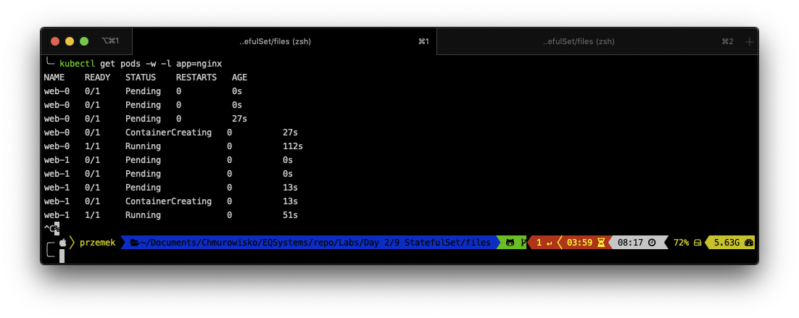
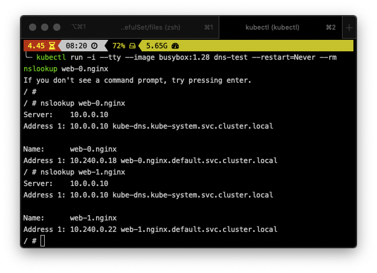
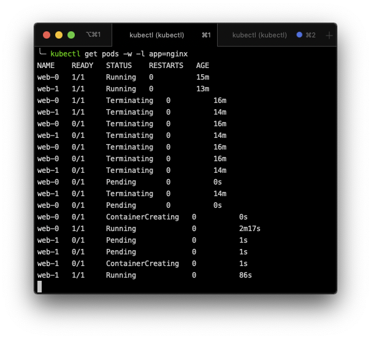
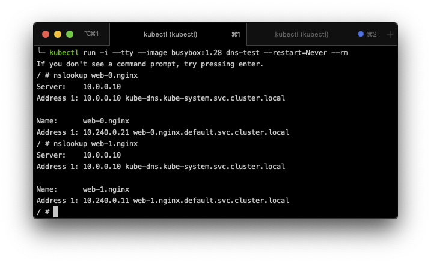

# StatefulSets

#### Poniższe zadania dotyczą StatefulSets

## Zadanie 1: Stworzenie StatefulSet

1. Otwórz dwa okna terminali
2. W pierwszym wpisz: ``kubectl get pods -w -l app=nginx``, aby obserwować tworzenie POD.
3. W drugim oknie stwórz plik *statefulset.yaml* w wybranym edytorze.
4. Zawartosć pliku jest tutaj: [StatefulSet manifest file](./files/statefulset.yaml). Wklej ją i zapisz zmiany w pliku.
5. Ten sam terminal, wywołaj polecenie:  
``kubectl apply -f statefulset.yaml`` aby stworzyć StatefulSet.
6. Przenieś się do pierwszego terminalu i zauważ zmiany:

Zauważ, że web-1 się nie uruchomi dopóki web-0 ma status: Pending.

## Zadanie 2: 

1. Każdy POD ma swoją nazwę, którą możesz odczytać z poziomu samego POD-a.
Wywołaj poniżesze dwa polecenia:
- `kubectl exec web-0 -- sh -c 'hostname'`  
- `kubectl exec web-1 -- sh -c 'hostname'`

2. Użyj *kubectl run* aby stworzyć kontener, w którym użyjesz ponownie polecenia nslookup:
``
kubectl run -i --tty --image busybox:1.28 dns-test --restart=Never --rm
``

3. Sprwadź nazwy DNS dla naszych dwóch kontenerów:  
- ``nslookup web-0.nginx``  
 
- ``nslookup web-1.nginx`` 

4. Wyjdź z terminala tego kontenera: ``exit``.
5. Nadal będąc w tym samym (drugim) terminalu, usuń POD-y:  
``
kubectl delete pod -l app=nginx
``
6. Obserwuj zmiany w pierwszym terminalu:

7. Wróc do drugiego terminalu. Ponownie użyj *kubectl run* aby stworzyć kontener, w którym użyjesz  polecenia nslookup:
``
kubectl run -i --tty --image busybox:1.28 dns-test --restart=Never --rm
``

9. Sprwadź nazwy DNS dla naszych dwóch kontenerów:  
- ``nslookup web-0.nginx``  
 
- ``nslookup web-1.nginx`` 

Mimo usunięcia POD: ordinals, hostnames, SRV records oraz A records się nie zmieniły, lecz adres IP powiązany z POD mógł ulec zmianie. 

## Wynik

Wynik wywołania poleceń: 
- `nslookup web-0.nginx`
- `nslookup web-1.nginx`

## Koniec pracy domowej

> Możesz teraz wywołać polecenie:  
> `kubectl delete namespace homwework5`  
> w celu usunięcia wszystkich stworzonych dzisiaj obiektów.